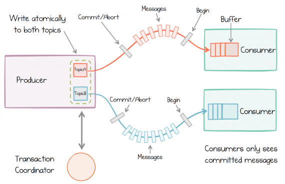

# Trasanctions

Kafka ships with built-in transactions, in much the same way that most relational databases do. The implementation is quite different, as we will see, but the goal is similar: to ensure that our programs create predictable and repeatable results, even when things fail.

Transactions do three important things in a services context:

• They remove duplicates, which cause many streaming operations to get incorrect results (even something as simple as a count).

• They allow groups of messages to be sent, atomically, to different topics—for example, Order Confirmed and Decrease Stock Level, which would leave the system in an inconsistent state if only one of the two succeeded.

• Because Kafka Streams uses state stores, and state stores are backed by a Kafka topic, when we save data to the state store, then send a message to another service, we can wrap the whole thing in a transaction. This property turns out to be particularly useful.

## The Duplicates Problem

Any service-based architecture is itself a distributed system, a field renowned for being difficult, particularly when things go wrong. Thought experiments like the Two Generals’ Problem and proofs like FLP highlight these inherent difficulties.  But in practice the problem seems less complex. If you make a call to a service and it’s not running for whatever reason, you retry, and eventually the call will complete. 

But retry leds to the problem of duplication.

In reality we handle these duplicate issues automatically in the majority of systems we build, as many systems simply push data to a database, which will automatically deduplicate based on the primary key. Such processes are naturally [**idempotent**](https://en.wikipedia.org/wiki/Idempotence)**.**

So if a customer updates their address and we are saving that data in a database, we don’t care if we create duplicates, as the worst-case scenario is that the database table that holds customer addresses gets updated twice, which is no big deal. This applies to the payment example also, so long as each one has a unique ID. As long as deduplication happens at the end of each use case, then, it doesn’t matter how many duplicate calls are made in between. This is an old idea, dating back to the early days of TCP (Transmission Control Protocol). It’s called [the end-to-end principle](https://en.wikipedia.org/wiki/End-to-end_principle).

## Deduplication

- Have an appropriate key that defines its identity.
-  Be deduplicated in a database that holds an extensive history of these keys. Or, duplicates have to be constantly considered in the business logic we write, which increases the cognitive overhead of this task.

## Exactly Once Is Both Idempotence and Atomic Comité

Idempotence is required in the broker to ensure duplicates cannot be created in the log. Idempotence, in this context, is just deduplication. Each producer is given an identifier, and each message is given a sequence number. The combination of the two uniquely defines each batch of messages sent. The broker uses this unique sequence number to work out if a message is already in the log and discards it if it is. This is a significantly more efficient approach than storing every key you’ve ever seen in a database.

On the read side, we might simply deduplicate (e.g., in a database). But Kafka’stransactions actually provide a broader guarantee, more akin to transactions in a database, tying all messages sent together in a single atomic commit. So idempotence is built into the broker, and then an atomic commit is layered on top.

## How Kafka’s Transactions Work Under the Covers

[Snapshot Marker Model.](http://bit.ly/2umAT2Q)

Kafka’s transactions are an adaptation of this idea, albeit with a subtly different

goal. While this approach to transactional messaging is complex to implement, conceptually it’s quite easy to understand (Figure 12-5). Take our previous example, where two messages were written to two different topics atomically. One message goes to the Deposits topic, the other to the committed_offsets topic. Begin markers are sent down both. 1 We then send our messages. Finally, when we’re done, we flush each topic with a Commit (or Abort) marker, which concludes the transaction.

