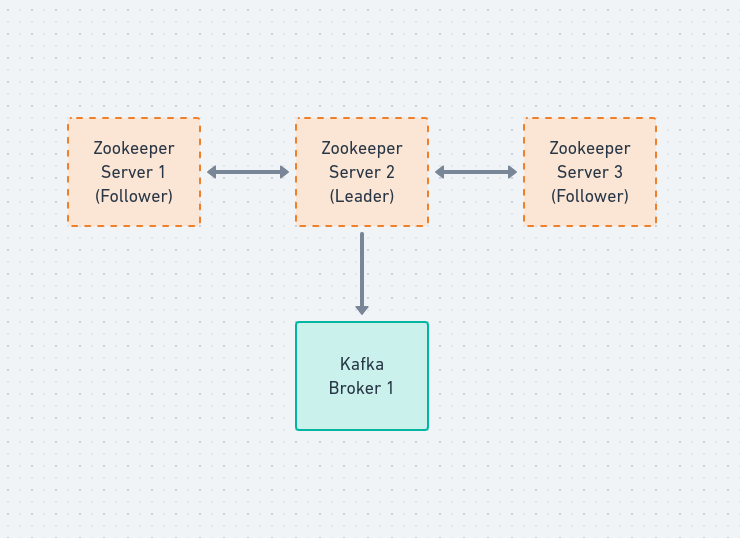
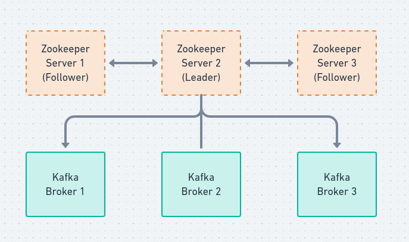
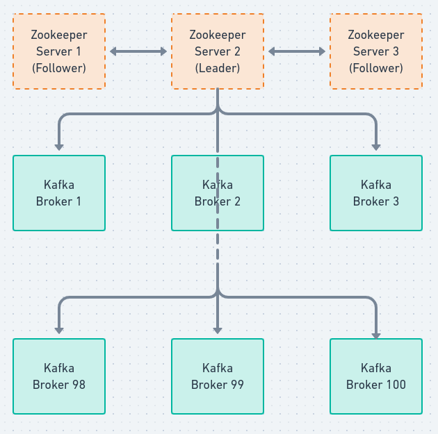

# Kafka Cluster Setup
#### Multi Servers deployment and configuration discussions
******

## Kafka Basics
- Brokers holds topics partitions
- Brokers recieve and serve data
- Brokers are the unit of parallelism of a Kafka cluster
- Brokers are the essence of "distributed" aspect of Kafka
    - The same way we set multiple zookeepers servers to form a **Quorum** we'll set multiple **kafka brokers** to form a **cluster**. Some [cluesters](https://engineering.linkedin.com/blog/2019/apache-kafka-trillion-messages) like Linkedin, and Netflix, have 100 brokers to serve 100K messages per second. So it's really highly scalable.

# Kafka Cluster Sizing

Now, you're maybe wondering 

> How big should a cluster be
> How many brokers should I have

When we talked about Zookeepers the answer was three or five, maximum, but for kafka... Let's talk about size:

- In the case of only 1 Broker:
    - If the broker is restarted, the Kafka cluster is down
    - The maximum replication factor for topics is 1
    - All producer and consumer requests go to the same unique broker
        - Only one point of failure
    - You can only scale vertically ( by increasing the instance size and restarting)
- It's very high risk, and only useful for development purposes

- In the case of 3 brokers:
    - N-1 brokers can be down, if N is your default [topic replication factor](https://jaceklaskowski.gitbooks.io/apache-kafka/content/kafka-topic-replication.html)
    - Ex: If N=3, then two brokers can be down
    - Producer and consumer requests are spread out between your different machines
    - Data is spread out between brokers, which means less disk space is used per broker.
    - You can have a cluster (this is our target for our course) - that's how we'll set up our cluster

## What about the extreme big number of 100 brokers?

We probably have five **Zookeepers** but let's ilustrate with three. Then 100 brokers. So what happens is:

- In the case of 100
    - Your cluster is fully distributed and can handle tremendous volumes, even using commodity (very basic) hardware.
    - Zookeeper may be under pressure because of many open connections, so you need to increase the Zookeeper instance performance.
    - **Cluster management is a full time job** (make sure no broker acts weirdly) - all big companies have an entire team dedicated to those tasks: managing kafka clusters.
     > "If you wanna propose 100 brokers make sure you have work for the rest of your life, without sleep"
    - It is not recommended to have a replication factor of 4 or more, and this would incur network communications within the brokers. Leave it as 3.
    - Scale horizontally only when a bottleneck is reached (network, i/o, cpu, ram)

