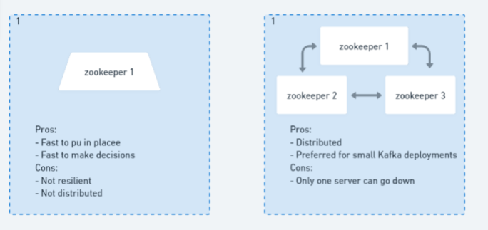

# What is Zookeeper

Zookeeper is a pillar for so many distributed applications because it provides features, such as: 

- Distributed configuration management
    - what is that
- Self election / consensus building
- Coordination and locks
- Key value store

Zookeeper is also used for other big data systems like [Hadoop](https://hadoop.apache.org/). Is very stable and it’s an Apache project that’ proven to be very stable and hasn’t had major release in many years: we’re using 3.4.x.

## Zookeeper like a file system

It’s a lot like a file system where any folder is a node. You should think it as a tree. Here some characteristics:

- Zookeeper internal data structure is like a tree
- Each node is called a **zNode **
- Each zNode has a path
- zNode can be **persistent **or **ephemeral**
    - A persistent zNode is alive all the time, an ephemeral  just go away when your app disconnects. Kafka uses boths  
- Each zNode can store other zNodes or some data.
- You can only copy some zNodes, but never rename’em.
- Each zNode can be **WATCHed** for changes: You can get from subscribers a updated value for a zNode content. What is awesome!

## Really good at what it does

Zookeeper is a minimal tool, but it does really well what it does.

# Role of Zookeeper in Kafka

 Zookeeper, in Kafka environments does on **Broker Registration **with heartbeats mechanism to keep the list current. So, if a broker gets disconnected, zookeeper will remove it because it hasn't said a** heart beats**. 

### Heart Beats

A heart beats is just a little message that servers send to each other to say “hey, I’m alive”, so, if a heart beat isn’t emitted for, say, 6 seconds, zookeepers can tell (“time out!“) that such a server isn’t alive anymore.

### Maintaining a list of topics alongside

All the topics in Kafka are configured in Zookeeper. So it has configuration such as:

- Their configuration ( partitions, replication factor, additional configurations...)
- The list of [ISRs](https://www.cloudkarafka.com/blog/what-does-in-sync-in-apache-kafka-really-mean.html) (in sync replicas) for partitions.


### Leader Election and Voting mechanism

Zookeepers, also perform leader elections in case some brokers go down. If you’re a broker, your leader broker is called the controller, if the controller goes down, Kafka loses its controller, so zookeeper needs to figured out who’s going to be the next controller. That’s when the voting mechanism comes handy.

In case some broker goes down, zookeeper has to vote which broker in a given broker is going to be the next leader. So leader election  is a really important Kafka need, because, the faster it’s done, the faster your service gets up and running when one goes down.

### Kafka cluster id store 

This is randomly generated the first time a cluster is set up. And, if you have security enabled, it’s for storing [ACL](https://docs.confluent.io/platform/current/kafka/authorization.html)s (Access Control Lists), that can be related to Topics, Consumers Groups and Users. It can also store Quotas if enabled.

### Summary

Zookeeper was presented as a key component of kafka ecosystem, without zookeeper Kafka can’t even think about existing. 


# Zookeeper Architecture Quorum sizing

When you’re in production and want’s to setup zookeeper, the question you’re gonna ask yourself is: 

> How many servers will zookeeper need? What’s your quorum sizing strategy
>

## Strict majority (2N+1)

You need an odd number of servers following the formule **2N+1 ** in order for you to allow in a given N integer for N servers to go down.



For the purpose of this architecture, 3 is far than enough.

# Zookeeper Configuration

It’s tricky to get a really good zookeeper configuration, because it depends on your network and your cluster, but there are some good defaults.

In your root folder, create a zookeeper folder 

```
mkdir zookeeper
```
and add this config:

```bash
# the location to store the in-memory database snapshots and, unless specified otherwise, the transaction log of updates to the database.
dataDir=/data/zookeeper
# the port at which the clients will connect
clientPort=2181
# disable the per-ip limit on the number of connections since this is a non-production config
maxClientCnxns=0
# the basic time unit in milliseconds used by ZooKeeper. It is used to do heartbeats and the minimum session timeout will be twice the tickTime.
tickTime=2000
# The number of ticks that the initial synchronization phase can take
initLimit=10
# The number of ticks that can pass between
# sending a request and getting an acknowledgement
syncLimit=5
# zoo servers
# these hostnames such as `zookeeper-1` come from the /etc/hosts file
server.1=zookeeper1:2888:3888
server.2=zookeeper2:2888:3888
server.3=zookeeper3:2888:3888

```

- **dataDir: ** Variable that indicates where the zookeeper data is stored.
- **clientPort:** Contains the number of the port that is, by default 2181 - no reason to change it.
- **maxClientCnxns: **If asserted to zero it means ilimited, but you could disable a maximum number of connections if you wanted to.
- **tickTime: **Is basically to define heartbeats time, which is in milliseconds, so 2k is a good number that means 2 seconds.
- **initLimit**: Is how many ticks it takes to initialize in synchronization. (in the case above it’s 10*2000 that is 20 seconds for the initial synchronization.
- **syncLimit:  **The number of ticks that can pass between sending a request and getting an acknowledgment. If, so, in 5 ticks we don’t get a sync the zookeeper will fail.
- **server.x**: So we can have as many zookeepers as we want.


 # AWS Configuration

First thing we do is going to the **VPC Dashboard **on AWS.

Click on subnets to make sure you find three minimum, cause they are the availability zone  and we’ll need three for set up.

Now we have to be sure the ending of each ip for the avaiable zone what zone it is: a,b or c. Taking not to them:

172.31.**16.0**/20   - sa-east-1**b**

 172.31.**32.0**/20  - sa-east-1**c**

172.31.**0.0**/20      -  sa-east-1**a **

### EC2

So, in the EC2 console we’ll launch an EC2 instance. And that’s going to be our first server and, for it we’re later setting up our security group and so on.

### Select the image

We’re selecting ubuntu 16.

### Select instance type

we’re using a t2.medium because it has 4 GiB of RAM and 2 CPUs, so it’s multithread.


We can keep from here by adding the ssh connection from our computer and that’s so cool. Good we paid the course

with say like 

`ssh -i <your_key_name> ubuntu@<your_ip>`

if it's necessary you

`chmod 0600 <your_key_name>`


# Sigle Machine Setup

1. SSH into your machine
2. Install some necessary (java) and helpful packages on the machine
3. Disable RAM Swap
4. Add hosts mapping from hostname to public ips to /etc/hosts
5. Download & Configure Zookeeper on the machine
6. Launch Zookeeper on the machine to test
7. Setup Zookeeper as a service on the machine

### Machine packages installation

```bash
#!/bin/bash
# Packages
sudo apt-get update && \
      sudo apt-get -y install wget ca-certificates zip net-tools vim nano tar netcat
# Java Open JDK 8
sudo apt-get -y install openjdk-8-jdk
java -version
# Disable RAM Swap - can set to 0 on certain Linux distro
sudo sysctl vm.swappiness=1
echo 'vm.swappiness=1' | sudo tee --append /etc/sysctl.conf
# Add hosts entries (mocking DNS) - put relevant IPs here
echo "172.31.9.1 kafka1
172.31.9.1 zookeeper1
172.31.19.230 kafka2
172.31.19.230 zookeeper2
172.31.35.20 kafka3
172.31.35.20 zookeeper3" | sudo tee --append /etc/hosts
# download Zookeeper and Kafka. Recommended is latest Kafka (0.10.2.1) and Scala 2.12
wget https://archive.apache.org/dist/kafka/0.10.2.1/kafka_2.12-0.10.2.1.tgz
tar -xvzf kafka_2.12-0.10.2.1.tgz
rm kafka_2.12-0.10.2.1.tgz
mv kafka_2.12-0.10.2.1 kafka
cd kafka/
# Zookeeper quickstart
cat config/zookeeper.properties
bin/zookeeper-server-start.sh config/zookeeper.properties
# binding to port 2181 -> you're good. Ctrl+C to exit
# Testing Zookeeper install
# Start Zookeeper in the background
bin/zookeeper-server-start.sh -daemon config/zookeeper.properties
bin/zookeeper-shell.sh localhost:2181
ls /
# demonstrate the use of a 4 letter word
echo "ruok" | nc localhost 2181 ; echo
# Install Zookeeper boot scripts
sudo nano /etc/init.d/zookeeper
sudo chmod +x /etc/init.d/zookeeper
sudo chown root:root /etc/init.d/zookeeper
# you can safely ignore the warning
sudo update-rc.d zookeeper defaults
# stop zookeeper
sudo service zookeeper stop
# verify it's stopped
nc -vz localhost 2181
# start zookeeper
sudo service zookeeper start
# verify it's started
nc -vz localhost 2181
echo "ruok" | nc localhost 2181 ; echo
# check the logs
cat logs/zookeeper.out

```
It’s good to know that by mocking the ips we want to, we don’t need to remember the ips anymore.